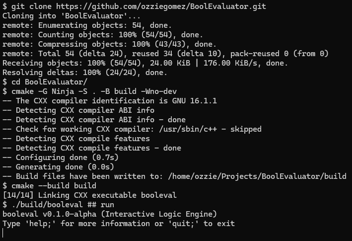

# BoolEvaluator

`booleval` is an interactive, cross-platform command-line utility designed to parse, evaluate, and analyze propositional logic formulas. Built using cutting-edge features of **C++26**, it provides a streamlined REPL for fast logical verification.

Or just my excuse to learn Modern C++

This is an evolution of [old booleval](https://github.com/ozziegomez/booleval.git)

**Current Version:** `v0.2.0-alpha`

---

## 🚀 Features

- **Interactive REPL:** Evaluate variables and expressions on the fly.
- **Dynamic Variable Assignment:** Track global truth values using `let <var> = true|false;`.
- **Comprehensive Truth Tables:** Generate step-by-step sub-expression breakdown tables with `tab: <expr>;`.
- **Deductive Argument Validation:** Check argument validity and hunt for logical fallacies instantly with `val: <p1>, <p2> // <c>;`.
- **Comments à la Python:**

---

## ✨ Examples

- **Variables**  
  

- **Truth Tables**  
  

- **Argument Validation**  
  

---

## 🛠️ Supported Operators

| Operator | Logic Gate | Syntax Example |
| :---: | :---: | :--- |
| `~` | **NOT** | `~p` |
| `&` | **AND** | `p & q` |
| `\|` | **OR** | `p \| q` |
| `->` | **IMPLIES** | `p -> q` |
| `<->` | **IFF** | `p <-> q` |


---

## 📦 Building from Source

This project requires a modern C++ compiler supporting the **C++26** standard (e.g., MSVC 2026+, GCC 16+, or Clang 22+).

### Using CMake & Ninja (Cross-Platform)

```bash
git clone https://github.com/ozziegomez/BoolEvaluator.git
cd BoolEvaluator
cmake -G Ninja -S . -B build
cmake --build build
```


